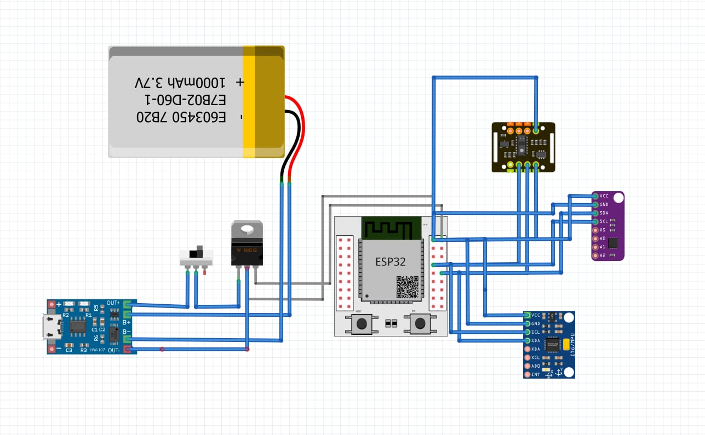

<p align="center">
  
</p>

<h1 align="center">Wellvia: Your GenAI-Powered Health & Nutrition Companion</h1>

<p align="center">
  <em>A production-ready, cloud-native mobile health platform developed for the <strong>IEEE CSTAM2.0 Hackathon</strong>.</em>
</p>

<p align="center">
  <!-- Badges for Tech Stack -->
  
  
  
  
  
</p>

## About The Project

**Wellvia** is an intelligent health and nutrition companion designed to provide users with a seamless, data-rich, and personalized wellness experience. It was engineered from the ground up to meet the rigorous demands of the IEEE CSTAM2.0 Technical Challenge, demonstrating a sophisticated end-to-end data processing pipeline, a scalable serverless architecture, and an innovative application of Generative AI.

Our mission is to empower users to take control of their health by transforming raw data from wearables and daily activities into actionable insights.

## Key Features

-   **Cross-Platform Mobile App**: A single, beautiful codebase built with **Flutter** provides a native experience on both iOS and Android.
-   **GenAI "Meal-to-Data"**: Snap a photo of your meal, and our GenAI-powered backend analyzes it to automatically log nutritional information (calories, protein, carbs, fats).
-   **Wearable & Sensor Integration**: Connects to Bluetooth Low Energy (BLE) devices to track real-time vitals like heart rate and SpO2.
-   **Holistic Health Tracking**: Log everything from manual workouts and water intake to sleep patterns and user-defined goals.
-   **Secure & Scalable Backend**: Built with **FastAPI** for high-performance, asynchronous processing and powered by **Google Firebase** for authentication, database, and storage.
-   **Offline First**: The mobile app is resilient, caching data locally to ensure functionality even without an internet connection.

## Technical Architecture

Wellvia is built on a modern, decoupled architecture that ensures scalability, security, and maintainability.

1.  **Flutter Frontend**: The client-side application that serves as the user's primary interface. It handles user input, sensor data collection via BLE, and secure communication with the backend.
2.  **FastAPI Backend**: The central nervous system of the application. This Python-based server orchestrates data validation, processing, and communication with Firebase services. It also houses the logic for interacting with external Generative AI models.
3.  **Google Firebase Suite**:
    -   **Firebase Authentication**: Manages user identity securely, handling sign-up, login, and session management using JWTs.
    -   **Cloud Firestore**: A NoSQL, real-time database that stores structured user data, health logs, and processed nutritional information.
    -   **Cloud Storage**: Provides scalable, secure storage for large binary objects, such as user-uploaded meal images.

## Project Visuals

#### Wearable Device Prototype
Our vision for Wellvia includes a sleek, minimalist wearable designed to continuously monitor user vitals.

<p align="center">
  
</p>

#### Hardware Circuit Diagram
The underlying hardware is based on the powerful and efficient ESP32 microcontroller, integrated with sensors for health monitoring.

<p align="center">
  
</p>

## Repository Structure

```
.
├── assets/                 # Image assets (logo, prototype, etc.)
├── back_end/               # FastAPI Backend (Python)
│   ├── app/                # Core application logic
│   ├── test_firestore.py   # Integration test for Firebase
│   └── requirements.txt    # Python dependencies
├── front_end/              # Flutter Frontend (Dart)
│   ├── lib/                # Main application source code
│   └── pubspec.yaml        # Flutter dependencies
├── firestore.rules         # Server-side security rules for Firestore
└── rapport.tex             # Formal IEEE Technical Report
```

## Getting Started

Follow these instructions to get a local copy of Wellvia up and running for development and testing.

### Prerequisites

-   Git
-   Flutter SDK (v3.x or higher)
-   Python (v3.8 or higher) & Pip
-   A Firebase project (for configuration files)
-   An editor like VS Code with Flutter & Python extensions.

### 1. Clone the Repository
```bash
git clone https://github.com/CHAABEN-Chahin/health_app.git
cd health_app
```

### 2. Set Up & Run the Backend
The backend includes a **demo mode** that allows it to run without live cloud credentials for easy testing.

```bash
# Navigate to the backend directory
cd back_end

# Create and activate a Python virtual environment
python -m venv venv
source venv/bin/activate  # On Windows use `venv\Scripts\activate`

# Install dependencies
pip install -r requirements.txt

# (Optional) For a full test, create a .env file and add your Firebase credentials path:
# echo "FIREBASE_CREDENTIALS_PATH=/path/to/your/serviceAccountKey.json" > .env

# Run the server (starts in demo mode if .env is not found)
uvicorn app.main:app --reload
```
The backend will be running at `http://127.0.0.1:8000`.

### 3. Set Up & Run the Frontend

```bash
# Navigate to the frontend directory
cd ../front_end

# Add your Firebase configuration files:
# - For Android: place your `google-services.json` in `front_end/android/app/`
# - For iOS: place your `GoogleService-Info.plist` in `front_end/ios/Runner/`

# Install Dart dependencies
flutter pub get

# Run the app on a connected device or simulator
flutter run
```

## Security by Design

Security is a core principle of Wellvia, implemented at every layer:
-   **Authentication**: Stateless authentication using JWTs issued and verified by Firebase.
-   **Authorization**: Granular access control enforced by server-side **Firestore Rules**, ensuring users can only access their own data.
-   **Secrets Management**: Adherence to best practices using `.env` files for backend credentials, which are never committed to version control.
-   **Secure On-Device Storage**: Sensitive tokens are stored in the platform's native secure enclave (Keychain on iOS, Keystore on Android) using `flutter_secure_storage`.

## Contributing

We welcome contributions to make Wellvia even better! Please open an issue to discuss any bugs or feature requests.

## License
This project is currently unlicensed.

---

**Team Members:**
-   AOUINI Anas
-   MECHRIA Khawla
-   KAMMOUN Mohamed Yassine
